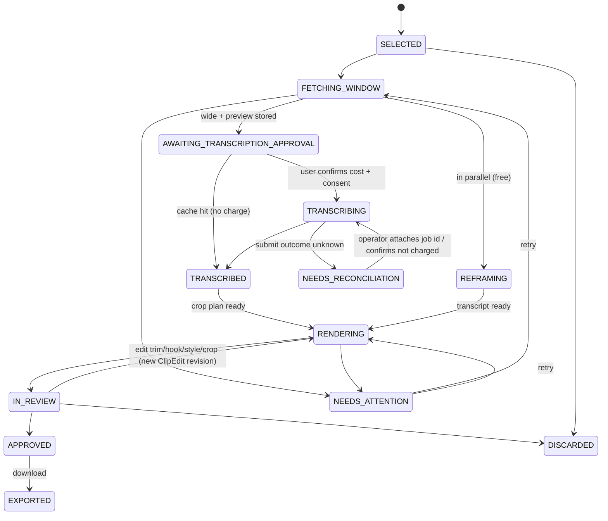

# Job and workflow state machine (Phase 0 proposal)

Owner: worker-infra, ai-transcription and cost-engineering (fork of tech-lead). Status: a proposal for founder review. No code has been changed.
It is grounded in `clipper.py` (`harmar_transcribe`, `api_json`, `upload_to_signed_url`), `harmar_clips.py`,
`fetch_clips.py`, `burn_captions.py`, `reframe.py`, the published Harmar contract (https://harmar.ai/developers,
read 2026-10-01) and timings measured on `pilot-03` (Apple M2, 8 cores).

Assumed tech-lead decisions: a modular Python monolith; a Postgres job table claimed with `FOR UPDATE SKIP LOCKED`
leases plus heartbeats; three worker pools, **net** (yt-dlp), **paid** (Harmar) and **cpu** (reframe/FFmpeg);
object storage for artifacts; and a single local operator in Phase 1.

## 1. Two levels of state

**Workflow state** is what the human sees on a Project or a Clip. It changes only through one domain
function (`advance(clip, event)`), in the same DB transaction as the job update that caused it. **Job state**
is the mechanics of one unit of background work. One clip goes through several jobs, and a failed job does not erase
the clip's progress: the clip shows `NEEDS_ATTENTION` with the failing job attached.

Renames from the founder's list, and why:
- `DOWNLOADING` is split into `IMPORTING_CAPTIONS`, which is project-level, free and about 200 KB, and `FETCHING_WINDOW`, which is
  per clip at 1080p. The full episode is never downloaded, and the names should make that obvious.
- `ANALYZING` stays at project level, because it covers the clipper heuristic over the whole caption file.
- `WAITING_FOR_SELECTION` becomes `AWAITING_SELECTION`. It is a human gate, and every gate uses the `AWAITING_` prefix.
- `AWAITING_TRANSCRIPTION_APPROVAL` is new. It is an explicit human gate before **every** paid call, and it carries the consent and cost confirmation.
- `TRANSCRIBING`, `REFRAMING` and `RENDERING` are kept per clip. Reframe can run in parallel with transcription, because it needs only the wide window.
- `READY_FOR_REVIEW` becomes `IN_REVIEW`. The new states `APPROVED`, `EXPORTED` and `DISCARDED` make the human decision explicit
  and give the product its key metric: which clip and style was approved, and after how many edits.
- `FAILED` becomes `NEEDS_ATTENTION` at workflow level. Real failures live on jobs, each with an error code and a retry action.

### 1a. Project states

```
DRAFT --url+consent saved--> IMPORTING_CAPTIONS --ok--> ANALYZING --ok--> AWAITING_SELECTION
  |                               |  fail                 | fail               | user selects >=1 clip
  |                               v                       v                    v
  |                         NEEDS_ATTENTION <-------------+              PROCESSING (derived: any clip busy)
  |                                                                            |
  +--user archive--> ARCHIVED <-- user archive -- IN_REVIEW <-- all selected clips >= IN_REVIEW
```

| From | Event | To | Guard | Side effects | Trigger |
|---|---|---|---|---|---|
| DRAFT | submit URL | IMPORTING_CAPTIONS | URL is youtube.com/youtu.be, ID matches `[A-Za-z0-9_-]{11}`, user ticked the rights checkbox | enqueue `import_captions` | user |
| IMPORTING_CAPTIONS | job ok | ANALYZING | an Armenian track exists (`hy-orig`/`hy`) | store SRT and duration; enqueue `analyze` | worker |
| IMPORTING_CAPTIONS | job permanent fail | NEEDS_ATTENTION | — | reason shown: private, removed, no Armenian captions | worker |
| ANALYZING | job ok | AWAITING_SELECTION | ≥1 candidate | store candidates with score breakdown | worker |
| AWAITING_SELECTION | select clips | PROCESSING | 1–5 clips, each 10–180 s | create Clip rows in `SELECTED`; enqueue `fetch_window` | user |
| PROCESSING | all selected clips terminal or IN_REVIEW | IN_REVIEW | — | — | system (derived) |
| any | archive | ARCHIVED | no paid job in `SUBMITTING`/`SUBMITTED` | cancel all cancellable jobs | user |

### 1b. Clip states



| From | Event | To | Guard | Side effects | Trigger |
|---|---|---|---|---|---|
| FETCHING_WINDOW | fetch ok | AWAITING_TRANSCRIPTION_APPROVAL | wide duration matches the plan ±0.5 s (as in `fetch_clips.py`) | enqueue `reframe` (free) | worker |
| AWAITING_TRANSCRIPTION_APPROVAL | lookup finds a Transcript with the same key | TRANSCRIBED | — | link the existing transcript; **no** charge | worker / system |
| AWAITING_TRANSCRIPTION_APPROVAL | confirm | TRANSCRIBING | ConsentRecord for the provider; budget and balance checks (§5) | create a `TranscriptionAttempt`; enqueue `transcribe` | **user only** |
| TRANSCRIBING | provider `completed` | TRANSCRIBED | — | store raw and normalized words; run auto-snap (`burn_captions.snap`) as revision 1 | worker |
| TRANSCRIBING | provider `failed` | NEEDS_ATTENTION | — | Harmar refunds automatically; resubmitting needs a new user confirmation | worker |
| TRANSCRIBING | outcome unknown | NEEDS_RECONCILIATION | — | lock out resubmission for this transcript key | worker / reaper |
| TRANSCRIBED + crop plan | both ready | RENDERING | — | enqueue `render` for each requested style | system |
| RENDERING | all style renders ok + checks pass | IN_REVIEW | the `CHECK:` rules from `burn_captions.py` are stored as warnings, not failures | — | worker |
| IN_REVIEW | edit | RENDERING | the edit is in the allow-list (trim within padding, hook ≤45 chars, style ∈ A/B/C, crop x within bounds, caption_bottom 600–1100) | new ClipEdit revision; enqueue renders | user |
| IN_REVIEW | approve style X | APPROVED | the asset for the current revision exists | record the approval (a metric) | user |
| any non-terminal | discard | DISCARDED | not TRANSCRIBING with a submitted attempt (a paid job keeps polling so the result is kept) | cancel free jobs | user |

## 2. Job states (all job types)

```
QUEUED --claim--> RUNNING --ok--> SUCCEEDED
  ^                 |  \--retryable error--> RETRY_WAIT --run_after reached--> QUEUED
  |                 |  \--permanent error / attempts exhausted--> FAILED
  |                 \--cancel_requested--> CANCELLED
  +-- reaper: lease expired and the job is safe to rerun (see §4)
```

Job row: `id, type, subject_id, idempotency_key UNIQUE, state, attempt, max_attempts, run_after, lease_owner,
lease_expires_at, heartbeat_at, progress (0–1), progress_msg, error_code, error_detail, cancel_requested, created_at,
finished_at`. Workers claim work with `... WHERE state='QUEUED' AND run_after<=now() AND type = ANY(pool_types)
ORDER BY created_at FOR UPDATE SKIP LOCKED LIMIT 1`. A claim sets a 60 s lease, and a heartbeat every 15 s extends it.
Enqueueing reuses the existing job if its idempotency key already exists, so a double click or a browser retry never creates a second job.

| Job type | Pool | Idempotency key | Timeout | Retries / backoff | Permanent errors |
|---|---|---|---|---|---|
| `import_captions` | net | `import:{project}:{video_id}` | 2 min | 3 tries; 10 s, 60 s, 5 min | private/removed video, no `hy` track, age/region lock |
| `analyze` | cpu | `analyze:{srt_sha}:{clipper_v}:{params_hash}` | 2 min | 1 (pure function) | no candidates |
| `fetch_window` | net | `fetch:{video_id}:{start}:{end}:{pad}:{recipe_v}` | 10 min | 3, deleting partial files each time (as in `fetch_clips.py`) | duration mismatch twice, size cap exceeded |
| `transcribe` | paid | `harmar:{logical_key}:{options_hash}` (§3) | step-specific | **step-specific; never at the submit step** | 4xx on create/submit, budget exceeded |
| `reframe` | cpu | `reframe:{wide_sha}:{reframe_v}` | 5 min | 2 | no video stream |
| `render` | cpu | `render:{clip_edit_id}:{rev}:{style}:{renderer_v}` | 10× clip length + 60 s | 2 | ASS/filter error (a bug in our own code, so file a bug rather than retry) |

## 3. The paid transcription job: exactly-once charging

### What Harmar does and doesn't offer (from the docs, 2026-10-01)

| Capability | Status |
|---|---|
| Idempotency key on `POST /v1/transcripts` | **Not documented**, so a repeated POST is a new job and a new charge |
| List jobs (`GET /v1/transcripts`) | **Not documented.** Only `GET /v1/transcripts/{id}`, so we cannot ask "did my POST create a job?" |
| Client reference / metadata field on submit | **Not documented** |
| Webhooks | Yes: `webhook_url` on submit; events `transcript.completed` / `transcript.failed`; header `Harmar-Signature: t=…,v1=…` HMAC-SHA256 with the `whsec_` secret; payload has `transcript_id`, `status`, `seconds_charged`, `seconds_refunded` |
| When the charge happens | At **submit** (`charged_before_processing: true`), rounded up to the whole second; **fully refunded on failure** |
| Cancel | **No.** `DELETE /v1/transcripts/{id}` returns 409 while the job is processing; delete afterwards is only useful for privacy |
| Statuses | `awaiting_upload`, `processing`, `completed`, `failed` |
| Limits | media up to 5 GB / 60 min; upload URL valid 1800 s; `429` with `Retry-After` |
| Balance | `GET /v1/balance` returns `seconds_remaining`, `minutes_remaining` |

Because there is no idempotency key and no list endpoint, the only protection against double billing is **our own
durable record, written before the charge point**, plus a balance check to reconcile anything left ambiguous.

### Attempt steps (each persisted before the network call that follows it)

| Step | Action | Retry rule | Crash/lease-loss outcome |
|---|---|---|---|
| `PREPARED` | Compute `media_sha256` of the bytes to send and the `logical_key = sha256(video_id, start, end, pad, extract_recipe_v)`. Look up a Transcript by `(provider, logical_key OR media_sha256, options_hash)`. A hit links it and stops | free | rerun |
| `RESERVED` | Lock the budget row (`SELECT … FOR UPDATE`); check per-project and per-day budgets; `GET /v1/balance` ≥ `ceil(duration)` × 1.1; write `balance_before` | free | rerun (release the reservation) |
| `UPLOAD_CREATED` | `POST /v1/uploads` → persist `media_id` and the URL expiry | free; 3 tries | rerun from here, or create a new upload if the URL is >25 min old |
| `UPLOADED` | PUT the bytes (as `upload_to_signed_url` does today: retry on 5xx and connection errors, fail on 4xx) | free; 3 tries, 5/10/15 s | rerun |
| `SUBMITTING` | **Commit this row first.** Then `POST /v1/transcripts` with `media_id`, options and `webhook_url` (production only) | **never automatically** | → `UNKNOWN_SUBMISSION` |
| `SUBMITTED` | Commit `provider_job_id` immediately: the first statement after the response, before logging or polling | — | rerun the **poll only** |
| `POLLING` | `GET /v1/transcripts/{id}` every 3 s, backing off to 30 s; or wait for the webhook | network errors retried forever | rerun the poll |
| `COMPLETED` / `PROVIDER_FAILED` | Store the raw result, `seconds_charged` and `quality`; normalise the words. On failure, record `seconds_refunded` | — | — |

How the outcome of the submit POST is classified:
- Connection refused or DNS failure before the request was sent: nothing was charged, so return to `UPLOADED` (safe to retry).
- `400/401/402/404/422`: rejected, nothing was charged, so the job is `FAILED` with the code shown.
- `429`: rejected; wait for `Retry-After` and retry with the same attempt. This assumes a 429 creates no job, which must be verified once with Harmar support (see §7).
- A `5xx`, a read timeout, a connection reset after sending, or a crash while in `SUBMITTING`: **`UNKNOWN_SUBMISSION`**.

**The danger window** runs from the moment Harmar accepts the POST to the moment we commit `provider_job_id`.
Three measures keep it small and make it recoverable:
1. The paid pool runs **one submission at a time per Harmar account**. With single-flight submits, a drop in balance
   between `balance_before` and now can be attributed to the one unknown attempt.
2. Reconciliation, done by an operator in Phase 1:
   - The UI shows `balance_before`, the current balance, and the expected charge of `ceil(duration)`.
   - If the balance dropped by exactly that amount, the operator pastes the job ID from the Harmar dashboard. We then poll it, at no charge.
   - If the balance did not drop, the operator confirms "not charged", which unlocks **one** new user-confirmed submission.
   - In production, a `transcript.*` webhook carrying an unknown `transcript_id` whose `seconds_charged` matches the attempt is attached automatically.
3. Nothing is ever resubmitted automatically: not by the reaper, not on a poll timeout, not on a worker restart.

**Poll timeout.** After 30 minutes the attempt is marked `STALLED` for the UI, but polling continues hourly for 24 hours. It never resubmits.
Today's `harmar_transcribe` raises after 15 minutes and resumes from the cached `job_id` on the next run, which is correct.

**Gaps in today's code** (for video-pipeline and qa; this doc does not fix them):
- `api_json` raises on any `HTTPError` or timeout during `POST /v1/transcripts`, and no job ID has been cached at that point.
  Re-running `harmar_clips.py` would **resubmit and charge again**. The SaaS adapter must use the `SUBMITTING` marker.
- `cache.write_text` is not atomic. A crash mid-write leaves invalid JSON, so writes should go to a temp file and then `os.replace`.
- A provider `failed` status raises on every rerun, and there is no explicit "resubmit after refund" path.
- The cache key is the sha256 of the letterboxed `clip_NN.mp4` alone. Re-encoding it gives different bytes and a second charge
  (README warns "never re-render clip_NN.mp4"). The `logical_key` above removes that trap.

**Migrating the existing caches.** An importer walks `pilot-*/harmar/clip_NN/harmar_transcript.json`. Each file with a
`response` becomes a `Transcript` with `provider='harmar'`, `provider_job_id`, `media_sha256=video_sha256`, the raw
result, `seconds_charged`, and options inferred from the result (`words` present means `timestamps=word`, otherwise `segment`). A file with only
a `job_id` becomes an attempt in `SUBMITTED`, and the first worker resumes polling it. The importer is read-only towards the files,
runs idempotently by job ID, and is checked by comparing the sum of `seconds_charged` with the Harmar dashboard. The figures are 62+70+63 = 195 s for pilot-03,
and pilots 01–02 are also in the files.

## 4. Leases, reaper, restart and cancellation

The **reaper** runs every 30 s. For each `RUNNING` job whose lease has expired (no heartbeat for 60 s):

| Job / step | Action |
|---|---|
| net, cpu jobs | Count the attempt and requeue with backoff; delete the job's temp dir |
| transcribe, before `SUBMITTING` | Requeue at the persisted step |
| transcribe, `SUBMITTING` | Set `UNKNOWN_SUBMISSION` and move the clip to `NEEDS_RECONCILIATION` |
| transcribe, `SUBMITTED`/`POLLING` | Requeue the poll only |

A worker restart is the same thing as an expired lease, so no other startup logic is needed. On SIGTERM, a worker stops claiming new
jobs, finishes or abandons the current one (child processes are killed, which is safe for idempotent jobs), and never
interrupts the window between POST and commit: the submit call and its commit form one critical section, during which shutdown waits.

**Cancellation.** The user sets `cancel_requested`. The worker checks it between steps and every progress tick, sends SIGTERM
to the child `yt-dlp`/`ffmpeg`/`reframe` process, and sends SIGKILL after 10 s. A transcribe job can be cancelled up to and
including `UPLOADED`. **After submit it cannot be cancelled, because Harmar offers no cancel**: the UI says "already paid; the
transcript will be kept", and polling continues so the charge is not wasted.

**Temp files.** Each job writes only under `work/{job_id}/`. Outputs are uploaded to object storage before the job is
marked `SUCCEEDED`, then the directory is removed. Failed jobs keep their directory for 24 hours for debugging, and the reaper then deletes it.
Transcript raw results are never deleted by cleanup. Losing them would cost money again.

**Progress reporting** (DB writes throttled to one every 2 s):
- `yt-dlp`: `--newline --progress-template`, which gives a percentage.
- `ffmpeg`: `-progress pipe:1`, using `out_time_us` ÷ the planned clip length. The loudnorm analysis pass counts as 10%.
- `reframe`: frames read ÷ `CAP_PROP_FRAME_COUNT`.
- `transcribe`: shows the step name, the poll count and "Harmar is processing".

## 5. Cost guards (these must exist before billing does)

| Guard | Default | Where it is enforced |
|---|---|---|
| Window length | 10–180 s, and ≤ 25% of the source | selection API and `transcribe` |
| Seconds per transcription run (all clips confirmed together) | ≤ 600 s (CLAUDE.md) | confirm endpoint |
| Harmar budget per project / per day (account) | 600 s / 1200 s | `RESERVED` step (locked row) |
| Balance margin | balance ≥ 1.1 × need | `RESERVED` step |
| Full-episode transcription | **refused**; there is no code path that submits the source asset | job type only accepts a window asset |
| Confirmation dialog | lists each window, its `ceil(sec)` and the total, balance before/after, AMD estimate, provider, consent | UI + server re-check |
| Max source duration (caption import) | 4 h | `import_captions` |
| Download size per window | `--max-filesize 500M`, height ≤ 1080 | `fetch_window` |
| Upload (Phase 2) | 4 GB; probed with `ffprobe` before accepting | upload API |
| Render concurrency | 1 per 4 cores; one 51 s render uses about 5.7 cores and 384 MB | cpu pool size |
| Render timeout | 10× clip length + 60 s | `render` |
| Re-render loop | ≤ 30 renders per clip per day | enqueue |
| Paid submissions in flight | 1 per Harmar account | paid pool |

### Cost model (measured on pilot-03 unless noted)

| Unit | Cost | Basis |
|---|---|---|
| Minute of source imported (captions only) | ≈ 0 (about 2 KB of SRT per minute; no Harmar, no video) | `source/` = 408 KB for 90 min |
| Minute of window downloaded (1080p) | ≈ 9 MB transfer + storage | `clip_NN.wide.mp4`: 27 MB for 192 s |
| Minute transcribed | **25–40 AMD** depending on the pack, rounded up per second, charged at submit, refunded on failure | Harmar docs |
| One pilot's transcription (3 clips) | 195 s charged for 192.3 s of media (+1.5% from rounding) = 81–130 AMD | `seconds_charged` 62/70/63 |
| Reframe per clip (about 65 s of 1080p) | ~32 CPU-s, 8 s wall | measured earlier this session |
| Render per style (51 s output) | **32 CPU-s, 5.6 s wall, 384 MB RSS**, plus a loudnorm pass of a few seconds | measured with `/usr/bin/time`, written to scratch |
| One full pilot (3 clips × A/B/C) | ≈ 6–7 CPU-minutes | 9 renders + 3 reframes + loudnorm |
| Storage per pilot | **110 MB**: renders 65 MB, wide 27 MB, previews 17 MB, transcripts 68 KB | `du` |

The largest cost risks are: an ambiguous submit that gets retried (§3); repeated full A/B/C re-renders on every edit,
where rendering only the edited style cuts CPU by 3×; wide windows and renders kept forever, at about 110 MB per pilot; and
long sources imported for analysis only, which is cheap until upload replaces YouTube import.

## 6. Notes for other agents

- **backend:** workflow transitions go only through `advance()`. The confirm endpoint is the only path to a paid job, and
  it re-checks consent, budgets and balance on the server.
- **video-pipeline:** split `harmar_transcribe` into the steps above. Key on `logical_key`. Write caches atomically.
  Consider sending **audio-only** (`m4a`, extracted from the wide window) instead of the letterboxed MP4. Harmar
  charges by duration, so the price is the same, but uploads shrink about 10× and the dependency on the preview render disappears.
- **media-storage:** `Transcript.raw_result` is the asset whose loss costs money. Back it up, and never put it under a TTL.
- **qa:** add tests for a submit timeout leading to `UNKNOWN_SUBMISSION` with no second POST; a reaper run during `SUBMITTING`; a poll
  timeout followed by a restart that leads to a single job ID; a cache hit after re-encoding the preview; a provider `failed` that needs user re-confirmation.

## 7. Decisions needing founder approval

1. **Who reconciles an `UNKNOWN_SUBMISSION`:** the operator in Phase 1, comparing balance and dashboard, rather than auto-guessing.
2. **The `logical_key`** (source + window + recipe) as the cache key alongside the bytes hash. With it, re-encoding never charges twice.
3. **Sending audio-only to Harmar** in place of the letterboxed preview. The first job under the new key costs the same as before.
4. **Default budgets:** 600 s per run, 600 s per project, 1200 s per day, plus the 1.1× balance margin.
5. **Render style A only by default**, with B and C on request, which saves about 2/3 of render CPU. The alternative is to keep rendering all three while still comparing styles with creators.
6. **A public webhook endpoint in production**, which requires storing the `whsec_` secret server-side. Phase 1 local stays poll-only.
7. **Retention of wide windows** for re-editing, for example 30 days after approval, and of rendered assets.
8. **Asking Harmar support** whether a `429` or `5xx` on submit can still create a job, and whether an idempotency key or job list
   is planned. Their answer could replace most of the reconciliation process.
